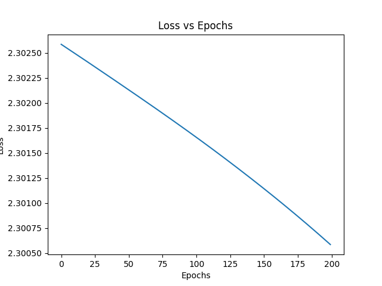
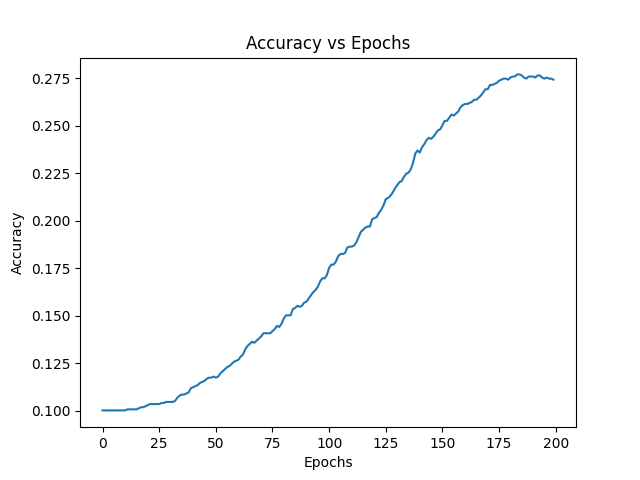

### Basic Neural Network from Scratch (NumPy)

### Overview

1. This project implements a feedforward neural network from scratch using NumPy to classify handwritten digits (0–9).
2. The objective of this work is to understand the internal mechanics of neural networks, including forward propagation, loss
computation, and backpropagation, without using high-level machine learning frameworks.

The project was completed as part of my AI internship to strengthen foundational understanding of neural networks at a low level.

**Problem Statement**

Given a dataset of handwritten digit images represented as numerical pixel values, the task is to build a model that can correctly classify each image into one of the ten digit classes (0–9).

**Tech Stack**

1. Python
2. NumPy – implementation of neural network logic
3. Matplotlib – visualization of training performance
4. scikit-learn – dataset loading only (no model training)

**Neural Network Architecture**

1. Input Layer: 64 neurons (8×8 pixel values flattened)
2. Hidden Layer: 32 neurons with ReLU activation
3. Output Layer: 10 neurons with Softmax activation

**Core Concepts Implemented**

1. Weight and bias initialization
2. Forward propagation
3. ReLU and Softmax activation functions
4. Categorical cross-entropy loss
5. Backpropagation with gradient descent
6. Accuracy evaluation
7. Training visualization (loss and accuracy trends)

**Learning Outcomes**

Through this project, I gained practical understanding of:

1. How neural networks learn by adjusting weights and biases
2. The role of activation functions and loss functions
3. How backpropagation minimizes prediction error
4. Why data normalization and proper initialization are important
5. How to verify learning behavior using performance plots

**Results**

During training:

1. Loss decreases consistently over epochs
2. Accuracy improves steadily, confirming effective learning

The following graphs are generated automatically:

1. Loss vs Epochs
2. Accuracy vs Epochs

These plots are saved in the results/ directory.

### Loss Curve
The graph below shows how the training loss decreases over epochs.



### Accuracy Curve
The graph below shows how classification accuracy improves during training.




**Project Structure**
```
basic-neural-network-from-scratch/
│
├── src/
│ └── neural_network.py
│
├── results/
│ ├── loss.png
│ └── accuracy.png
│
├── README.md
└── requirements.txt
```

**How to Run the Project**

1. Install Dependencies
pip install -r requirements.txt

2. Execute the Program
python src/neural_network.py

**Notes**

1. All neural network computations are implemented using NumPy only
2. No deep learning frameworks (TensorFlow, PyTorch, Keras) are used
3. The implementation prioritizes clarity and conceptual correctness

**Author** <br>
Kanishka Sharma <br>
B.Tech – Computer Science (AI & ML) <br>
AI Internship Project
